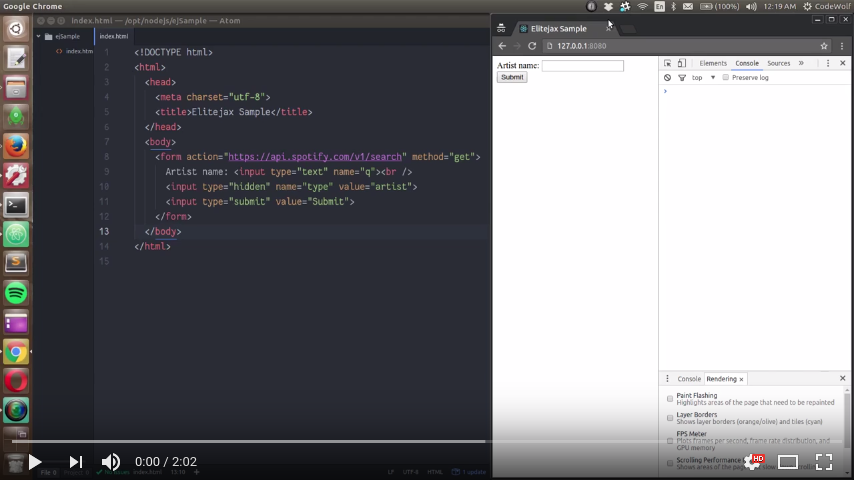

# elitejax

Simplifying Ajax Requests Using HTML attributes

### **Introduction**
---
Elitejax is a standalone javascript library that makes AJAX requests a lot more easier without you writing a single line of javascript.

All you have to do is add data-elitejax="true" attribute to your form tag and you are good to go


#### **Example**

* To send an AJAX reequest to the spotify API Endpoint, searching for artists by name:

```html
<form data-elitejax="true" action="https://api.spotify.com/v1/search" method="get">
  Enter Artist name: <input type="text" name="q"><br />
  <input type="hidden" name="type" value="artist">
  <input type="submit" value="Submit">
</form>

<!-- include elitejax library from bower components directory -->
<script src="bower_components/elitejax/build/elitejax.min.js" charset="utf-8"></script>
```

### **Sample Usage Video**

[](https://youtu.be/Hg9Xilkc5M0)

### **Installation**
---
You can install this library by cloning this git and reference the javascript files from the build directory or using bower:
```
bower install elitejax
```

### Exclude form field
___
To exclude a form field in your form from your AJAX request, you can add data-ej-x attribute to that field, like:
```html
<!-- below form field will be ignored -->
<input type="input" data-ej-x />
```

### Adding custom configurations
---
Due to elitejax's flexibility you can add custom configuration for each form in your webpage. First specify a name for your form and the use it with ej.configure, like so:

```html
<form name="spotify" action="" method="get">
.....

</form>

<script type="text/javascript">
    ej.configure('spotify'[, {configuration}]);
</script>
```

The configuration object argument for the configure method takes 4 parameters:

async **default: true** : You can set this to true or false

cType **default: "application/json"** : This is the content type header.

resType **default: "json"** : This is the response type of the AJAX query, you can use jsonp for cross domain requests.

callback **default: function** : The default callback logs the data to the console. You can specify your callback function for when the request completes successfully

## **License**
Elitejax is Licensed under the [MIT License](../master/LICENSE)

## **Contributing**
Please do! Send a pull request after your modifications.

Sharing is caring.... make sure to let your peers know.
